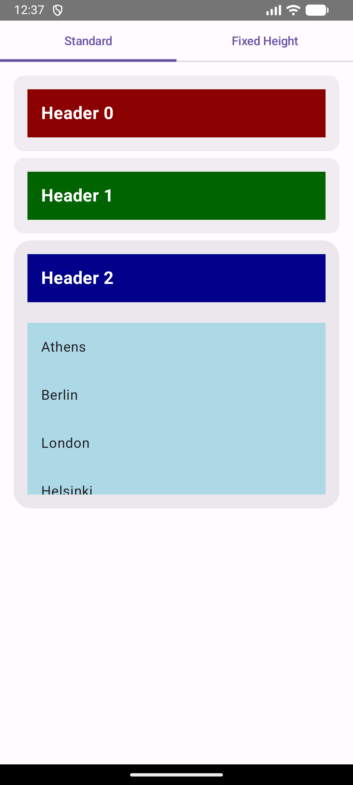
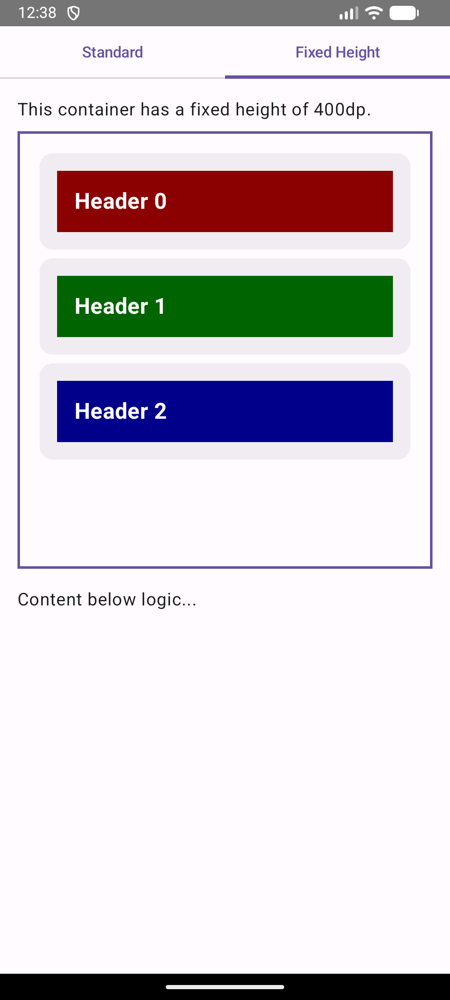

# RoboAccordionView

A modern, Jetpack Compose-based Accordion component for Android, implementing Material 3 Expressive Design.

Previously a Java/View-based library (2013), now fully modernized for 2026.

| Standard | Fixed Height |
|----------|--------------|
|  |  |

## Features

- **Jetpack Compose**: Built entirely with declarative UI.
- **Material 3 Expressive**: Supports Material styling, shapes, and motion.
- **Smooth Animations**: powered by `animateContentSize`.
- **Easy API**: Simple functional API with Slots for Header and Content.

## Installation

Add the library module to your project (currently local):

```kotlin
dependencies {
    implementation(project(":roboaccordionview"))
}
```

## Usage

```kotlin
val items = listOf("Item 1", "Item 2", "Item 3")
var expandedIndex by remember { mutableStateOf<Int?>(0) }

AccordionView(
    items = items,
    expandedIndex = expandedIndex,
    onExpandedIndexChange = { expandedIndex = it },
    headerContent = { item, isExpanded ->
        Text(text = item, fontWeight = FontWeight.Bold)
    },
    bodyContent = { item ->
        Text(text = "Details for $item...")
    }
)
```

## Legacy Support

The old Java `RoboAccordionView` has been removed in favor of the Composable version.
If you need the old View-based implementation, please stick to version 0.1 (or check out previous git tags).

## License

Apache License 2.0
